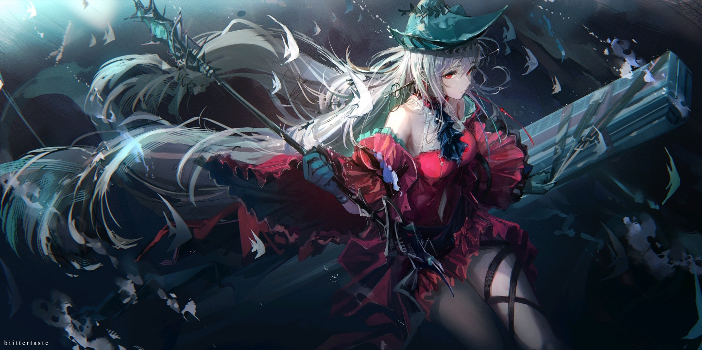
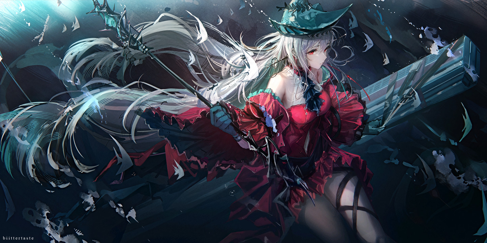

# GPT Upscale Skills

**Reconstruct detail with overlapping AI image edits, align and blend the patches, then deliver a large PNG and a layered SVG.**

[中文](README.md) · [Skill instructions](SKILL.md) · [CLI](references/cli.md) · [Operating guide](references/workflow.md)

This skill distills a real illustration-refinement workflow: initial SVG line work evolved into independent portrait edits, full-image tiled redraws, and coordinated batches. The agent supplies visual judgment and image-tool calls; portable scripts handle geometry, compositing, and verification.

## Real examples

These are unchanged comparison files selected from completed tasks in the original workflow. They illustrate the method; they were **not regenerated by this repository's new helper** and do not demonstrate native 8K model output.

| Before · 1445×720 | After · 7680×3827 |
|---|---|
| [](examples/sample3/before.png) | [](examples/sample3/after.png) |

Full PNGs: [sample3/before.png](examples/sample3/before.png) · [sample3/after.png](examples/sample3/after.png). The after image is the exact selected 8K PNG, about 57.5 MiB. This example used 11 generative tile redraws, one conservative source-based repair, and an independent face edit.


See [example provenance](examples/README.md) for comparison stages, dimensions, hashes and image rights. The MIT license covers code and documentation, not the underlying artwork or its derivative example images.

## What it does

1. Inspect the oriented source and choose a target that preserves aspect ratio.
2. Plan overlapping tiles according to the editor's actual output capacity.
3. Edit each crop using shared invariants and crop-specific observations.
4. Align through bounded affine ECC and smoothed, limited optical flow.
5. Match low-frequency color, choose continuous low-difference seams, and blend.
6. Apply separately reviewed, shaped detail layers for faces or important objects.
7. Export a PNG and standalone SVG with embedded raster layers.
8. Render the actual full-size SVG, compare it with the PNG, and inspect visual quality separately.

The manifest is the work queue. Missing, stale or unreviewed regions block final export. Per-region retries archive earlier attempts. Source-based fallbacks remain explicitly labeled. Authorized subagents may own separate images or region IDs; sequential operation is supported too.

## Install

Use an agent host that understands `SKILL.md` and provides an image-editing tool. Helpers require Node.js 22+.

From your host's skills root, clone under the skill's folder name:

```sh
git clone https://github.com/AKRTR465/GPT-upscale-skills.git tiled-image-refinement
cd tiled-image-refinement
npm ci
```

Ensure the host sees `tiled-image-refinement/SKILL.md`, then refresh discovery if needed. For development, clone into any working directory.

```text
Use $tiled-image-refinement to reconstruct this illustration at a 7680-pixel
long edge, preserving its aspect ratio. Refine the face independently,
deliver a PNG and layered SVG, and save prompts and comparison records.
```

No generation model, service or API key is bundled. The CLI does deterministic postprocessing only. Use the host image editor for redraws; it does not silently switch to a paid API when that capability is missing.

For manual commands, masks, resumability and output records, read [the CLI guide](references/cli.md). Run `npm run check` and `npm test` for synthetic functional tests that make no model calls.

## Resolution and limits

"8K" normally means a 7680-pixel long edge here, not a fixed aspect ratio. Already larger sources are preserved by default; a minimum short edge is a separate option. Native generated crops can be smaller than their destination, so interpolation remains part of placement. SVG layers are bitmaps, not infinitely scalable vector paths.

Added texture and fine structure are interpretive. Correlation and render matching do not prove authenticity or visual improvement. Preserve deliberate blur, grain and art style; inspect identity, anatomy and seams at 100%.

The helper supports opaque still images. Optional requested object/overlay removal uses a separately reviewed clean source; it is not automatically added to enlargement tasks. See [the operating guide](references/workflow.md).

Code and documentation: [MIT](LICENSE). Example artwork: separate rights retained by the respective rights holders, as described in [examples](examples/README.md).
