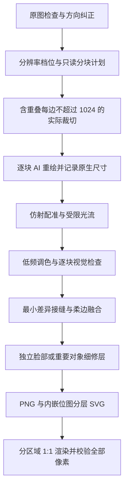

# GPT Upscale Skills

**自动规划每边不超过 1024 像素的重叠小块，用 AI 逐块补绘，再校准、融合，输出 2K、4K、8K、16K 或自定义尺寸的 PNG 和分层 SVG。**

[English](README.en.md) · [Skill 指令](SKILL.md) · [命令行用法](references/cli.md) · [方法细节](references/workflow.md)

这套 skill 来自实际的插画超分工作流：从 SVG 补线、脸部局部重绘，逐步发展到整图分块重绘和多图并行处理。它把可复用的决策写进 skill，把位置校准、拼接和文件验证交给确定性脚本。

## 实际示例

以下示例来自原工作流已完成的实际任务。它们展示工作流的效果，**不是本仓库新脚本重新生成的结果，也不是原生 8K 生成能力的证明**。

### sample1：局部细节


### sample2：人物细修


### sample3：完整前后图

| 原图 · 1445×720 | 重绘后 · 7680×3827 |
|---|---|
| [](examples/sample3/before.png) | [](examples/sample3/after.png) |

点击预览查看完整 PNG：[sample3/before.png](examples/sample3/before.png) · [sample3/after.png](examples/sample3/after.png)。`sample3/after.png` 保留所选 8K 文件的全部像素，约 57.5 MiB。该例为 11 块生成重绘、1 块保守修复，加独立脸部细修。

对比的具体阶段、像素尺寸与文件哈希见 [示例说明](examples/README.md)。原画权利归原权利人，示例图片不属于代码的 MIT 许可范围。

## 工作流



- **细节来自重绘。** 图像编辑工具负责生成，Node.js 脚本负责后处理；脚本本身不会调用模型。
- **分块数量自动计算。** 按目标画布和重叠宽度规划网格，每块连同上下文边缘都不超过 1024×1024；默认相邻重叠 128 像素。
- **脸部单独处理。** 独立区域超过块上限时自动拆成子块，先拼好区域，再应用一次父区域形状蒙版；完整对象缩略图可作为独立上下文参考。
- **任务可续跑。** 每块独立记录状态；缺块、未检查或已过期的结果会阻止最终导出；可归档重做单块。
- **并行按需启用。** 用户或宿主授权时用 subagent，每张图/分块有明确负责人；也支持单 agent 顺序完成。
- **记录结果边界。** 保留原生生成尺寸、实际提示词、保留原图区域、校准统计和文件哈希。
- **大图使用磁盘暂存。** TIFF 底图、文件支持的合成画布和分区域 SVG 校验覆盖 16K 横图、竖图与方图；规划阶段先报告资源需求。

## 分辨率档位与 1K 限制

档位按长边计算，始终保持原图比例；默认选 8K。已经大于所选档位的原图保留原尺寸，因此报告会同时列出请求档位和实际尺寸。2K 在本项目中采用 QHD 显示器命名，即 2560×1440 横图；其他比例使用相同长边。

| 档位 | 目标长边 | 16:9 示例 | 默认网格 | 基础编辑块数 |
|---|---:|---:|---:|---:|
| 2K / QHD | 2560 | 2560×1440 | 3×2 | 6 |
| 4K | 3840 | 3840×2160 | 5×3 | 15 |
| 8K | 7680 | 7680×4320 | 9×5 | 45 |
| 16K | 15360 | 15360×8640 | 18×10 | 180 |

表格使用单块上限 1024、相邻重叠 128 的默认配置，且原图不大于目标。独立细节块和重试另计。对于其他比例，程序根据实际尺寸计算；需要 2048 或 4096 等长边时使用 `--long-edge`。

每侧扩展 64 像素后，默认核心区上限为 `1024 − 128 = 896`。每个方向超过 1024 时，按 `ceil(目标边长 / 896)` 等分；该方向不超过 1024 则只用一块。生成整数裁切坐标后再次校验尺寸、覆盖和邻域条件。手动网格同样必须满足上限，不能用缩小一个超大区域的输入来绕过限制。

命名参考：[BenQ 的 2K/QHD 说明](https://www.benq.com/en-us/knowledge-center/knowledge/why-choose-a-27-monitor-for-qhd-1440p-gaming.html)、[ITU 的 4K/8K 说明](https://www.itu.int/hub/2020/04/new-itu-reports-help-shape-next-tv-revolution-high-dynamic-range-hdr/)、[VESA 的 16K 配置](https://vesa.org/press/vesa-publishes-displayport-2-0-video-standard-enabling-support-for-beyond-8k-resolutions-higher-refresh-rates-for-4k-hdr-and-virtual-reality-applications/)。任意比例图片采用相应长边，是本项目约定。

## 安装为 skill

需要支持 `SKILL.md` 的代理环境，以及可用的图像编辑工具。确定性辅助脚本要求 **Node.js 22+**。

将仓库克隆到宿主的 skills 目录，文件夹命名为 `tiled-image-refinement`。例如 Codex 的自定义 skills 根目录：

```sh
git clone https://github.com/AKRTR465/GPT-upscale-skills.git tiled-image-refinement
cd tiled-image-refinement
npm ci
```

上面的命令在你的 skills 根目录执行；`SKILL.md` 应位于 `tiled-image-refinement/SKILL.md`。若只是阅读或开发，也可以克隆到任意工作目录。必要时刷新宿主的 skill 列表。

调用示例：

```text
使用 $tiled-image-refinement，把这张插画按原比例做到 8K。
先输出分块计划，含重叠的每块宽高不超过 1024，再用图像工具重绘。
单独细修人物脸部，输出 PNG 和分层 SVG。
```

```text
使用 $tiled-image-refinement，并行处理这三张图。
保持原比例；已经超过 8K 的图保留原尺寸。保存提示词、对比图和验收记录。
```

宿主没有图像编辑工具时，只能准备分块和后处理；本项目不内置模型，不会自动改用付费 API。

## 手动使用脚本

```sh
node scripts/pipeline.cjs plan input.png --preset 8k --max-tile-edge 1024 --overlap 128
node scripts/pipeline.cjs prepare input.png jobs/example --preset 8k --max-tile-edge 1024 --overlap 128
```

`plan` 只输出 JSON，不创建任务或底图，不调用模型。`prepare` 使用同一份规划逻辑，创建 `base.tiff`、分块图和任务记录。切换到其他档位只需修改 `--preset`；自定义长边、短边与档位参数互斥。

查看分块，通过宿主图像工具完成重绘后，再导入并校准单块：

```sh
node scripts/pipeline.cjs ingest jobs/example r1c1 returned-image.png --prompt-file r1c1-prompt.txt
node scripts/pipeline.cjs align jobs/example r1c1
```

检查 `jobs/example/qa/r1c1.jpg` 和原尺寸局部，记录视觉验收；所有块完成后导出：

```sh
node scripts/pipeline.cjs accept jobs/example r1c1 --note "已检查轮廓和边界衔接"
node scripts/pipeline.cjs status jobs/example
node scripts/pipeline.cjs assemble jobs/example deliveries/example-v1
node scripts/pipeline.cjs verify deliveries/example-v1
```

这只是调用顺序示意，需要处理所有计划中的分块后才能合成。人物蒙版、单块重试、原图保留与详细参数见 [CLI 文档](references/cli.md)。

## 分辨率与适用边界

1K 硬约束针对实际输入裁切及其目标覆盖范围，不能控制图像工具原生返回的尺寸。返回图仍可能较小，放置时仍包含插值。SVG 里的重绘层是位图，不是可无限放大的纯矢量路径。每个任务选择一个输出档位，不会自动逐档重绘，也不会自动导出所有档位。

**不再设置固定的总像素上限，每任务仍最多 1000 个实际编辑块**，包含独立细节区域的子块。程序统一检查尺寸计算、经典 TIFF 文件寻址边界及目的磁盘可用空间。`plan --work-dir 目标目录` 可只读检查磁盘；创建任务、添加区域、合成与校验会在写入前检查各自的文件系统。估算包含导出，并加 20% 与 256 MiB 余量，不等于预留空间。大图合成和校验串行执行。[资源边界说明](references/resources.md)。旧任务的坐标保持不变；若需向超过 1K 的旧区域导入新结果，应从原图建立新任务。

新增纹理、发丝和装饰细节属于推断补绘，可能改变原画的小细节。配准相关性与 PNG/SVG 一致性不能证明内容真实或画质优秀，仍需逐块视觉检查。原图中的虚化、纸感和平涂画风应按创作意图保留。

默认处理不透明静态图像。去水印或移除对象仅在用户提出时进行，采用单独的清理步骤，详见 [方法说明](references/workflow.md#optional-authorized-removal-edits)。

## 仓库结构

```text
SKILL.md                 代理读取的核心工作流
agents/openai.yaml       可选的 Codex UI 元数据
references/              操作、提示词与 CLI 文档
scripts/pipeline.cjs     分块、校准、合成、验收脚本
scripts/resources.cjs    尺寸、TIFF 边界与磁盘资源检查
tests/                   不调用模型的功能测试
examples/                完整前后图、两张局部对比及来源记录
```

验证命令：`npm run check`、`npm test`。功能测试覆盖自动分块、区域组、旧任务、文件支持的合成和全像素 SVG 校验；独立大图验收覆盖 16K 横图、4:3、方图、竖图及 37258×8640 自定义画布，并以单进程峰值内存不超过 4GiB 为验收标准。测试使用合成图，不调用模型，也不评价模型重绘质量。

代码和文档使用 [MIT License](LICENSE)。示例原画及其衍生对比图保留原权利人的权利，详见 [示例说明](examples/README.md)。

v0.2.0 的 Windows 本地四种比例 16K 验收已全部通过，最高进程峰值为 **555.89 MiB**（方图）；每张 PNG 与 SVG 均完成全像素对照。[原始验收报告](validation/windows-16k.json)记录了尺寸、时间、误差和磁盘估计。

v0.2.1 的 37258×8640（约 322MP）Windows 本地验收已通过：420 个基础块，全像素比较成功，进程峰值 **570.36 MiB**，完整测试约 158 秒。这里使用合成图，未调用生成模型。[原始验收报告](validation/windows-322mp.json)。
