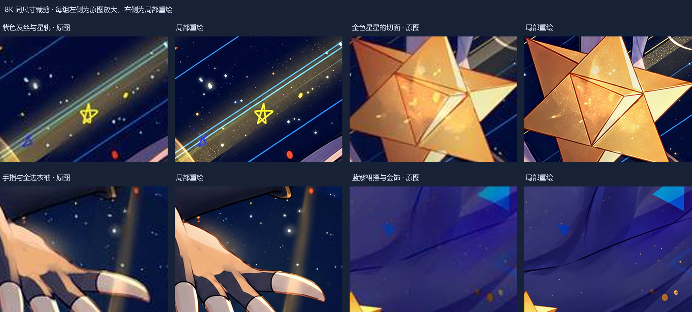
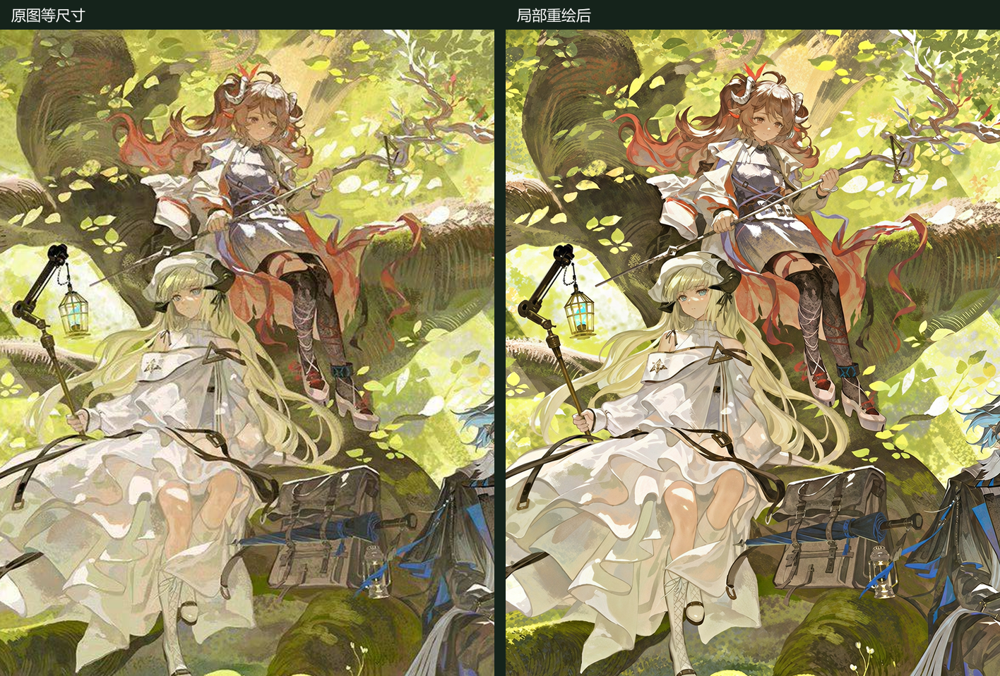
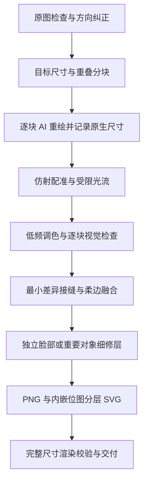

# GPT Upscale Skills

**把图片分成重叠小块，用 AI 逐块补绘细节，再校准、融合，输出大尺寸 PNG 和分层 SVG。**

[English](README.en.md) · [Skill 指令](SKILL.md) · [命令行用法](references/cli.md) · [方法细节](references/workflow.md)

这套 skill 来自实际的插画超分工作流：从 SVG 补线、脸部局部重绘，逐步发展到整图分块重绘和多图并行处理。它把可复用的决策写进 skill，把位置校准、拼接和文件验证交给确定性脚本。

## 实际示例

以下示例来自原工作流已完成的实际任务。它们展示工作流的效果，**不是本仓库新脚本重新生成的结果，也不是原生 8K 生成能力的证明**。

### 绯红魔女：完整前后图

| 原图 · 1445×720 | 重绘后 · 7680×3827 |
|---|---|
| [](examples/before.png) | [](examples/after.png) |

点击预览查看完整 PNG：[before.png](examples/before.png) · [after.png](examples/after.png)。`after.png` 保留所选 8K 文件的全部像素，约 57.5 MiB。该例为 11 块生成重绘、1 块保守修复，加独立脸部细修。

### 星海流光：局部细节



### 林间群像：人物细修



对比的具体阶段、像素尺寸与文件哈希见 [示例说明](examples/README.md)。原画权利归原权利人，示例图片不属于代码的 MIT 许可范围。

## 工作流



- **细节来自重绘。** 图像编辑工具负责生成，Node.js 脚本负责后处理；脚本本身不会调用模型。
- **分块数量可调整。** 4×3、3×4、6×2 都只是起点，应根据画面和实际返回分辨率决定。
- **脸部单独处理。** 用有上下文的局部重绘与形状蒙版保留表情、视线和边缘衔接。
- **任务可续跑。** 每块独立记录状态；缺块、未检查或已过期的结果会阻止最终导出；可归档重做单块。
- **并行按需启用。** 用户或宿主授权时用 subagent，每张图/分块有明确负责人；也支持单 agent 顺序完成。
- **记录结果边界。** 保留原生生成尺寸、实际提示词、保留原图区域、校准统计和文件哈希。

## 安装为 skill

需要支持 `SKILL.md` 的代理环境，以及可用的图像编辑工具。确定性辅助脚本要求 **Node.js 22+**。

将仓库克隆到宿主的 skills 目录，文件夹命名为 `tiled-image-refinement`。例如 Codex 的自定义 skills 根目录：

```sh
git clone https://github.com/AKRTR465/GPT-upscale-skills.git tiled-image-refinement
cd tiled-image-refinement
npm ci
```

上面的命令在你的 skills 根目录执行；`SKILL.md` 应位于 `tiled-image-refinement/SKILL.md`。若只是阅读或开发，也可以克隆到任意工作目录。必要时刷新宿主的 skill 列表。

调用示例：

```text
使用 $tiled-image-refinement，把这张插画按原比例做成长边 7680 的超清图。
先检查每块细节，用图像工具重绘，单独细修人物脸部，输出 PNG 和分层 SVG。
```

```text
使用 $tiled-image-refinement，并行处理这三张图。
保持原比例；已经超过 8K 的图保留原尺寸。保存提示词、对比图和验收记录。
```

宿主没有图像编辑工具时，只能准备分块和后处理；本项目不内置模型，不会自动改用付费 API。

## 手动使用脚本

```sh
node scripts/pipeline.cjs prepare input.png jobs/example --long-edge 7680 --cols 4 --rows 3 --pad 224
```

查看分块，通过宿主图像工具完成重绘后，再导入并校准单块：

```sh
node scripts/pipeline.cjs ingest jobs/example r1c1 returned-image.png --prompt-file r1c1-prompt.txt
node scripts/pipeline.cjs align jobs/example r1c1
```

检查 `jobs/example/qa/r1c1.jpg` 和原尺寸局部，记录视觉验收；所有块完成后导出：

```sh
node scripts/pipeline.cjs accept jobs/example r1c1 --note "已检查轮廓和边界衔接"
node scripts/pipeline.cjs status jobs/example
node scripts/pipeline.cjs assemble jobs/example deliveries/example-v1
node scripts/pipeline.cjs verify deliveries/example-v1
```

这只是调用顺序示意，需要处理所有计划中的分块后才能合成。人物蒙版、单块重试、原图保留与详细参数见 [CLI 文档](references/cli.md)。

## 分辨率与适用边界

这里的 **8K 通常指输出画布长边 7680 像素**，不是所有比例都等于 7680×4320。竖图和超宽横幅保持原比例；短边要求需要单独指定。每个生成块可能小于最终覆盖范围，放置时仍包含插值。SVG 里的重绘层是位图，不是可无限放大的纯矢量路径。

新增纹理、发丝和装饰细节属于推断补绘，可能改变原画的小细节。配准相关性与 PNG/SVG 一致性不能证明内容真实或画质优秀，仍需逐块视觉检查。原图中的虚化、纸感和平涂画风应按创作意图保留。

默认处理不透明静态图像。去水印或移除对象仅在用户提出时进行，采用单独的清理步骤，详见 [方法说明](references/workflow.md#optional-authorized-removal-edits)。

## 仓库结构

```text
SKILL.md                 代理读取的核心工作流
agents/openai.yaml       可选的 Codex UI 元数据
references/              操作、提示词与 CLI 文档
scripts/pipeline.cjs     分块、校准、合成、验收脚本
tests/                   不调用模型的功能测试
examples/                完整前后图、两张局部对比及来源记录
```

验证命令：`npm run check`、`npm test`。测试检查确定性后处理，不评价模型重绘质量。

代码和文档使用 [MIT License](LICENSE)。示例原画及其衍生对比图保留原权利人的权利，详见 [示例说明](examples/README.md)。
